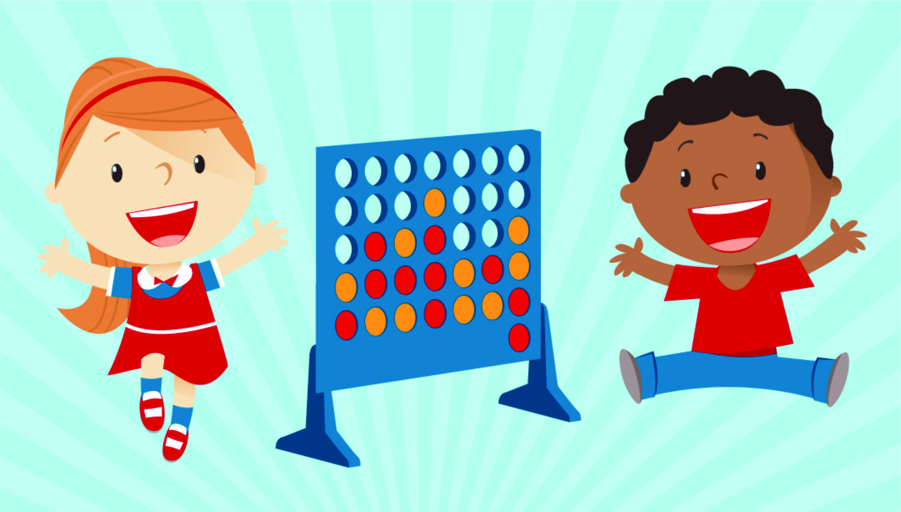

# connect 4

## description
a 2 player game with a standing board players put discs in the coluumns until a player connects 4 discs diagonaly, horezontaly or from corner to corner 

## user stories

User Stories for Connect 4 Game
1. Starting a New Game

**Title**: Start a New Game
As a player
I want to start a new game
So that I can play Connect 4 with another player.

2. Placing a Disc


**Title**: Place a Disc
As a player
I want to place a disc in one of the columns
So that I can make a move and try to connect four of my discs in a row.

3. Winning the Game


**Title**: Win the Game
As a player
I want to be notified when I have connected four of my discs in a row
So that I know I have won the game.

4. Detecting a Draw


**Title**: Detect a Draw
As a player
I want to be notified when the game ends in a draw
So that I know the game is over without any winner.

5. Restarting the Game

**Title**: Restart the Game
As a player
I want to restart the current game
So that I can start over without finishing the current game.

## sudo code 
### 1. Starting a New Game

```
FUNCTION startNewGame():
    Initialize an empty game board
    Set currentPlayer to Player 1
    Display the empty game board
    Display message: "New game started. Player 1's turn."

startNewGame()
```
### 2. playing a disc 
```
FUNCTION placeDisc(column):
    IF column is full:
        Display message: "Column is full. Choose another column."
        RETURN

    FOREach cell in chosen column from bottom to top:
        IF cell at [coloumn , i] is empty:
            Place currentPlayer's disc in cell at [colomn, i]
            Display the updated game board

            IF checkWin(row, column):
                Display message: `Player 
                ${currentPlayer} wins!`

            IF disc played is on top
                IF checkDraw():
                    Display message: "The game is a draw."

            Display message: `Player  
            ${currentPlayer}'s turn.`
```

### 3. winning the game 
```
FUNCTION checkWin(row, column):
    // for every disc playedCheck if there are 3 discs in a row in any direction +last played
     i-3, i-2, i-1, i, i+1, i+2, i+3, 
     j-3, j-2, j-1, j, j+1, j+2, j+3, 
    (i-1, j+1), (i-2, j+2), (i-3, j+3),
    (i+!, j-1), (i+2, j-2), (i+3, j-3),
    RETURN TRUE if there are 4 connected discs, otherwise FALSE
```
### 4. check draw
```
FUNCTION checkDraw():
     if disc played is on top of the board Check
        if all cells in the game board are filled
    RETURN TRUE if the board is full, otherwise FALSE
```

### restarting game 
```
FUNCTION restartGame()
startNewGame();

```


