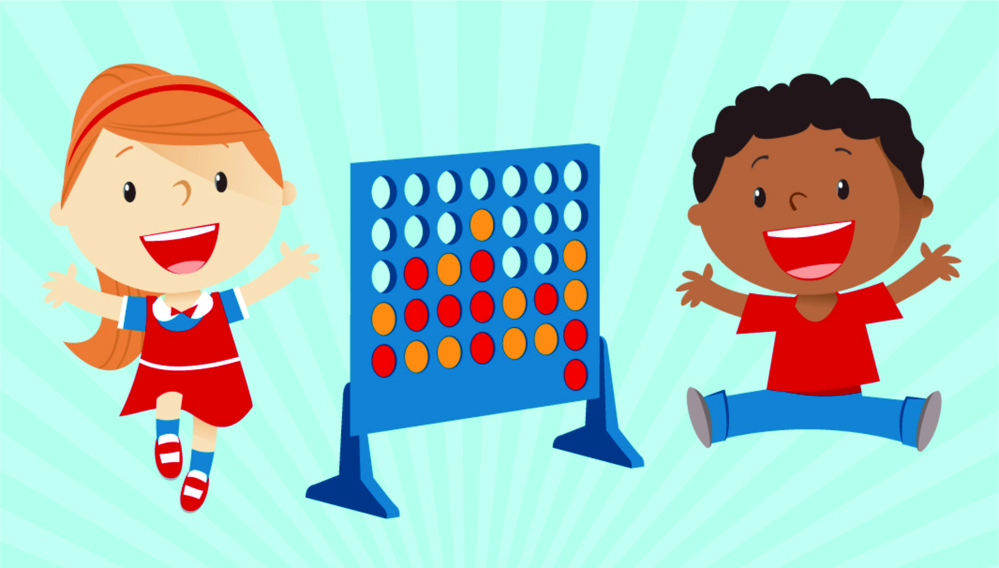

# connect 4

## description
a two player game with a standing board players put discs in the coluumns until a player connects 4 discs diagonaly, horezontaly or from corner to corner 

[demo](https://alihadi202.github.io/connect4/)

## Date: 10/7/2024

### By: Ali hadi

### ***Technologies Used***
* HTML
* CSS
* JavaScript
***

## ***Screenshots***

*** 

### ***Future Updates***

- [ ] flip game mode
- [ ] 3 and more players game mode

***

### ***Credits***

##### Markdown Guide: [README-Sample](https://github.com/zeemohamed7/README-Sample/blob/main/README.md)

##### code: [Chatgpt](https://chatgpt.com/) (little bit)

##### code: [MDN](https://developer.mozilla.org/en-US/)

***